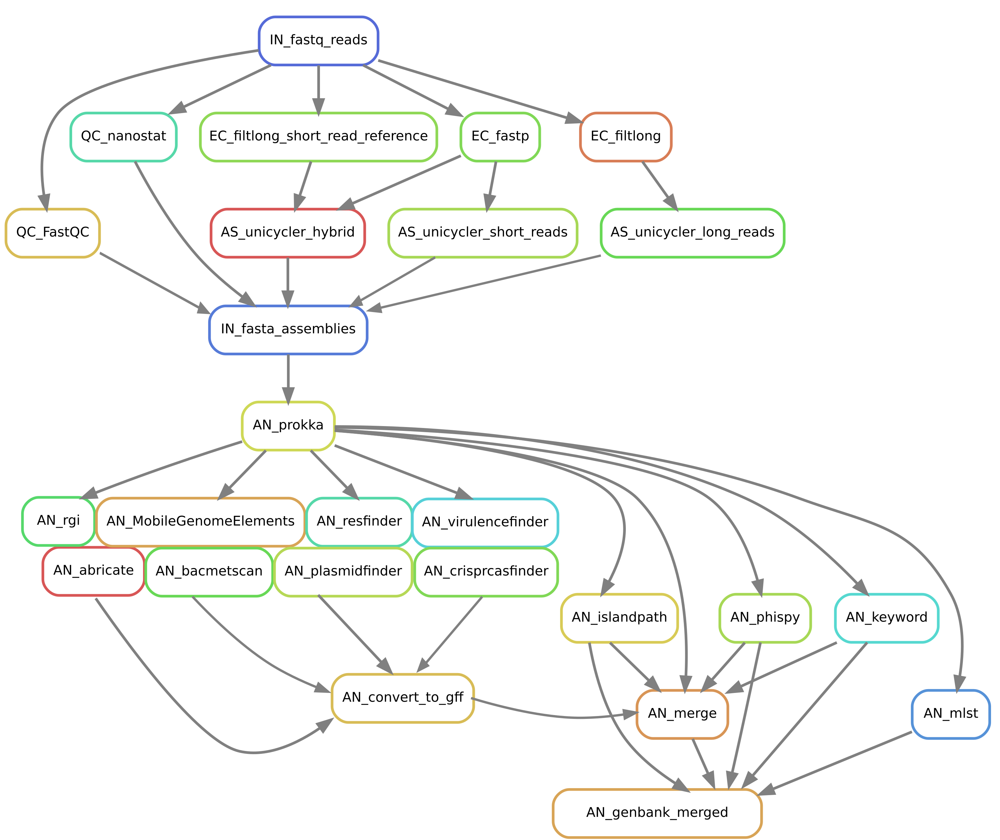

# Snakestaph
Snakestaph is a Snakemake pipeline developed for the assembly and annotation of staphylococcal genomes.

<p align="center"></p>

# Quick start
To perform quality control and assembly of reads and annotation of contigs.
```
conda activate snakemake

snakestaph.py quality -i reads.csv -o snakestaph
snakestaph.py assembly -i reads.csv -o snakestaph
snakestaph.py annotation -i contigs.csv -o snakestaph
```

# Installation
Snakestaph depends on the workflow manager  [Snakemake](https://snakemake.readthedocs.io/en/stable/getting_started/installation.html#) and the package managers [Conda](https://docs.conda.io/projects/conda/en/latest/user-guide/install/index.html) and [Singularity](https://docs.sylabs.io/guides/3.0/user-guide/installation.html) which must be set up before running the pipeline.

```
#install miniconda
mkdir -p ~/miniconda3
wget https://repo.anaconda.com/miniconda/Miniconda3-latest-Linux-x86_64.sh -O ~/miniconda3/miniconda.sh
bash ~/miniconda3/miniconda.sh -b -u -p ~/miniconda3
rm -rf ~/miniconda3/miniconda.sh

#initalize miniconda
~/miniconda3/bin/conda init bash
#set up channels for bioconda
conda config --add channels defaults
conda config --add channels bioconda
conda config --add channels conda-forge

#install snakemake and singularity
conda install -n base -c conda-forge mamba
mamba create -c conda-forge -c bioconda -n snakemake snakemake=7.8,singularity

#install snakemake
git clone https://github.com/kovavo/snakestaph/
export path
```

# Options
Run ```snakestaph.py --help``` to see the basic options. The pipeline can be also be run directly run with Snakemake from Snakefile.smk. See details [here](https://snakemake.readthedocs.io/en/stable/executing/cli.html)

```
usage: snakestaph.py [-h] [-i INPUT] -o OUTPUT [-e ENVIROMENTS] [-s SHADOW] [-t THREADS] [-u] [-d] {assembly,quality,annotation}

Snakemake workflow to assembly, annotate and analyse staphylococcal genomes

positional arguments:
  {assembly,quality,annotation}
                        Choose workflow

options:
  -h, --help            show this help message and exit
  -i INPUT, --input INPUT
                        Text file with columns
  -o OUTPUT, --output OUTPUT
                        Set output directory
  -e ENVIROMENTS, --enviroments ENVIROMENTS
                        Directory where the conda and singulaity enviroments will be stored
  -s SHADOW, --shadow SHADOW
                        Conda shadow directory, in grid computing it should be set to scratch directory
  -t THREADS, --threads THREADS
                        number of threads used by snakemake
  -u, --unlock          Unlock snakemake directory (eg. after unexpected power off)
  -d, --dryrun
```

# Input
The snakestaph accepts csv files as input. For the quality or assembly subcommands the file must contain the following columns:
|STRAIN|RUN|ILLUMINA_R1|ILLUMINA_R2|NANOPORE|NOTE|
|---|---|---|---|---|---|
|The strain name.<br>Cannot contain '-' or '_'.|The assembly run id.<br>Must be unique and Cannot contain '-' or '_'.|Absolute path to Illumina left reads in fastq format.<br> Value can be left empty. The fastq file can be gzipped.|Absolute path to Illumina right reads in fastq format.<br> Value can be left empty. The fastq file can be gzipped.|Absolute path to Nanopore long reads in fastq format.<br> Value can be left empty. The fastq file can be gzipped.|Not mandatory, use for notes, metadata etc.|

The annotation subcommand needs these columns: You can use anything for the input, even contigs from any other assembler.
|GENUS|SPECIES|STRAIN|RUN|PATH|NOTE|
|---|---|---|---|---|---|
|The genus name.<br>Cannot contain '-' or '_'.|The species name.<br>Cannot contain '-' or '_'.|The strain name<br>Cannot contain '-' or '_'.|The annotation run id.<br>Cannot contain '-' or '_'.|Absolute path to contigs in fasta format.<br>The fasta file can be gzipped|Not mandatory, use for notes, metadata etc.|

# Output
The output is in the form of directories. Snakemake keeps track of files and directories and uses that for evaluation of what needs to be done. If you plan to run snakestaph again, do not rename them.
```
{output} #output directory
├── annotation
│   ├── {output}.merged.gbk #merged annotations in single genbank file
│   ├── assembly
│   ├── prokka
│   └── special
│       ├── {output}.{program}.gff #You can provide your own GFF table for custom annotation here.
│       ├── abricate
│       ├── bacmetscan
│       ├── crisprcasfinder
│       ├── islandpath
│       ├── mefinder
│       ├── mlst
│       ├── phispy
│       ├── plasmidfinder
│       ├── resfinder
│       ├── rgi
│       └── virulencefinder
├── assembly
│   ├── {output}.fasta #assembled contigs
│   └── unicycler
├── config
└── reads
    ├── corrected
    ├── qc  #check quality of input reads
    └── raw
```
# Citation
Please cite the appropriate software if you use this pipeline:
<br>
> Kovařovic V., Snakestaph, Github https://github.com/kovavo/snakestaph
<br><br>
> FastQC - [Andrews, S. (2010). FastQC:  A Quality Control Tool for High Throughput Sequence Data](http://www.bioinformatics.babraham.ac.uk/projects/fastqc/)<br>
> Nanostat - [doi:10.1093/bioinformatics/bty149](https://doi.org/10.1093/bioinformatics/bty149)<br>
> Filtlong - [Seemann T, Filtlong, Github https://github.com/tseemann/Filtlong](https://github.com/rrwick/Filtlong)<br>
> Fastp - [doi:10.1093/bioinformatics/bty560](https://doi.org/10.1093/bioinformatics/bty560)<br>
> Unicycler - [doi:10.1371/journal.pcbi.1005595](https://doi.org/10.1371%2Fjournal.pcbi.1005595)<br>
> Prokka - [doi:10.1093/bioinformatics/btu153](https://doi.org/10.1093/bioinformatics/btu153)<br>
> IslandPath - [doi:10.1093/bioinformatics/bty095](https://doi.org/10.1093/bioinformatics/bty095)<br>
> PhiSpy - [doi:10.1093/nar/gks406](https://doi.org/10.1093%2Fnar%2Fgks406)<br>
> MeFinder -  [doi:10.1093/jac/dkaa390](http://dx.doi.org/10.1093/jac/dkaa390)<br>
> PlasmidFinder - [doi:10.1128/AAC.02412-14 ](https://doi.org/10.1128/aac.02412-14)<br>
> Resfinder - [doi:10.1093/jac/dks261]()<br>
> VirulenceFinder - [doi:10.1128/JCM.01269-20](https://doi.org/10.1128/jcm.01269-20)<br>
> Abricate - [Seemann T, Abricate, Github https://github.com/tseemann/abricate](https://github.com/tseemann/abricate)<br>
> NCBI AMRFinderPlus - [doi: 10.1128/AAC.00483-19]()<br>
> CARD, RGI - [doi:10.1093/nar/gkw1004]()<br>
> ARG-ANNOT - [doi:10.1128/AAC.01310-13]()<br>
> VFDB - [doi:10.1093/nar/gkv1239]()<br>
> MEGARES 2.00 - [doi:10.1093/nar/gkz1010]()<br>
> Bacmetscan - [doi:10.1093/nar/gkt1252](https://doi.org/10.1093/nar/gkt1252)<br>
> CRISPRCasFinder - [doi:10.1093/nar/gky425](https://doi.org/10.1093/nar/gky425)<br>
> MLST - [Seemann T, mlst Github https://github.com/tseemann/mlst](https://github.com/tseemann/mlst)<br>
